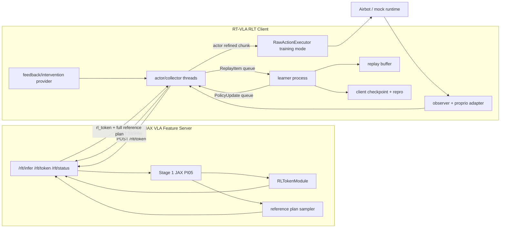
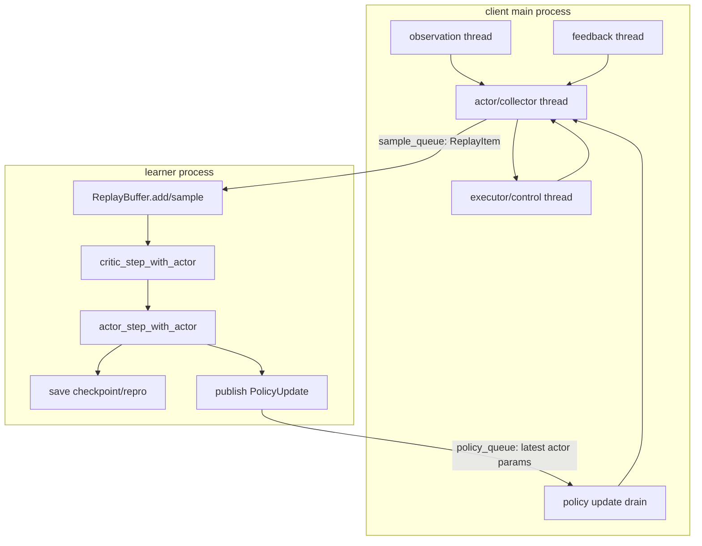
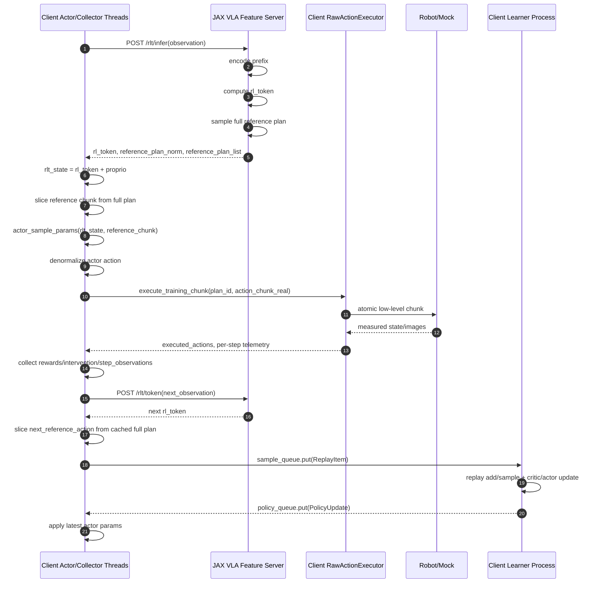
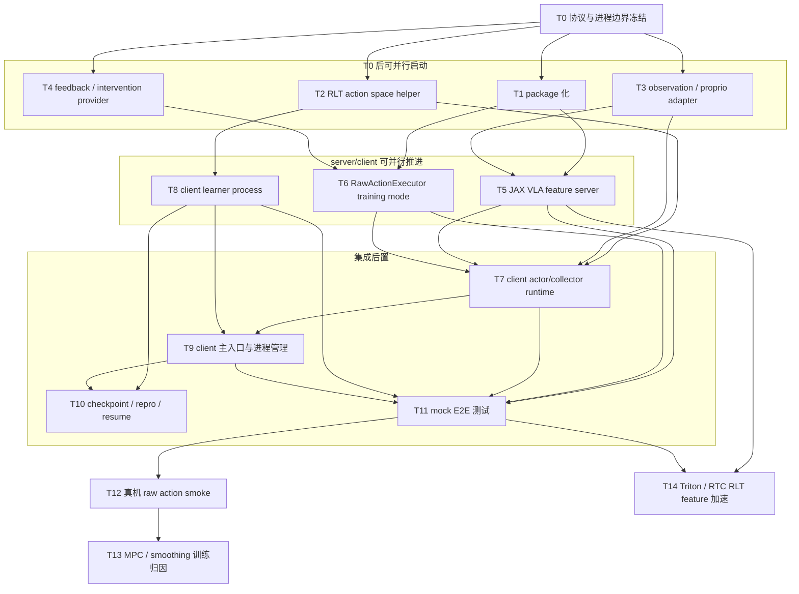

# RLT Stage 2 在线训练迁移到 Real-Time VLA v2 方案

## 1. 背景

当前仓库有两套相互独立但能力互补的运行时：

- RLT 两阶段训练在 `src/openpi/rlt/` 和 `scripts/train_rlt_online.py` 中实现。Stage 2 在线训练会冻结 Stage 1 的 `PI05 + RL token`，只训练轻量 actor / twin critic。
- Real-Time VLA v2 在 `realtime-vla-v2/` 中实现。它提供 server / client 分离的部署栈，包含快速 VLA 推理、action prefill、时间轴规划、平滑 / MPC 执行、真实 Airbot I/O 和运行日志。

迁移目标是把 RLT Stage 2 的在线训练接入 Real-Time VLA v2 的运行时，但 **RL 模型只在 client 中运行**。server 只负责冻结的 Stage 1 VLA/RL-token feature 与 reference plan 服务；client 侧保留 actor/learner 分离，其中 actor/collector 运行在 client 主进程的多线程运行时中，learner 使用独立进程。

## 2. 目标与非目标

### 目标

1. 复用 Real-Time VLA v2 的 server-client 通信、observer、executor、logging 和真实 Airbot I/O。
2. server 只运行冻结的 Stage 1 JAX VLA feature/reference 服务，不持有 Stage 2 actor/critic/learner。
3. client 内部保留当前 RLT Stage 2 的并发模型：
   - actor/collector 多线程运行时：请求 VLA feature，运行 RLT actor，执行 action chunk，构造 replay item。
   - learner 独立进程：维护 replay buffer，训练 actor/critic，保存 checkpoint，并把最新 actor 参数发布给 actor/collector。
4. `/rlt/infer` response 必须返回 client 本地 RL actor 所需的 `rl_token` 和完整 VLA reference plan。
5. 新增 `/rlt/token`，用于 next observation 只生成 RL token，不重新跑完整 VLA action inference。
6. Stage 2 checkpoint 在 client 侧保存，部署时 client 加载 actor checkpoint，server 继续提供 VLA feature/reference plan。
7. 首版使用 JAX feature path 保证语义正确；Triton / RTC 加速作为后续优化。

### 非目标

1. 不重写 RLT 算法，不改变 actor / critic loss。
2. 不把 Stage 2 actor/critic/learner 放到 server。
3. 不让 server 通过 `/rlt/feedback` 构造 replay 或更新 actor。
4. 不直接复用 `realtime-vla-v2/client/local_client.py` 的普通异步推理循环来构造 replay；client 需要新增训练模式，确保 action lineage、reward、intervention 和 replay chunk 对齐。
5. 不要求 pure Triton 完成首版训练闭环。当前 `openpi_rtc_triton` 只返回动作，缺少 RLT 必需的 RL token。

## 3. 当前代码边界

### 3.1 RLT Stage 2 现状

入口：`scripts/train_rlt_online.py`

关键流程：

1. 从 `pi05_airbot_rlt_token` Stage 1 checkpoint 加载冻结的 `PI05 + RL token`。
2. 用 `policy.model.encode_prefix` 和 `policy.model.compute_rl_token` 提取 `rl_token`。
3. 拼接 `rl_token + observation.proprio` 作为 RLT state。
4. 用 `policy.model.sample_reference_actions` 生成 VLA reference plan。
5. actor 输入 `(rlt_state, reference_action)`，输出 normalized action chunk。
6. action chunk 反归一化后传给 `AirbotRLTEnv.step()`。
7. env 返回 `step_rewards`、`executed_actions`、`intervened_mask`、`step_observations`。
8. collector 侧构造 replay item，learner 进程异步更新 actor / critic。

现有 observation schema：

```python
{
    "state": np.ndarray,        # shape (14,), joint position + gripper
    "proprio": np.ndarray,      # shape (28,), position + velocity
    "images": {
        "cam_high": np.ndarray,
        "cam_left_wrist": np.ndarray,
        "cam_right_wrist": np.ndarray,
    },
    "prompt": str,
}
```

### 3.2 Real-Time VLA v2 现状

server 入口：`realtime-vla-v2/server/infer_server.py`

client 入口：`realtime-vla-v2/client/local_client.py`

server model adapter：

- `OpenPiRTCJaxAdapter`
- `OpenPiRTCTritonAdapter`

client runtime：

- `robot_io.py`：Airbot / RealSense / mock observer 和 actuator。
- `executor.py`：`RawActionExecutor`、`OnDeviceMpcExecutor`、action queue、prefill、平滑、MPC、日志事件。

当前 infer payload：

```python
{
    "images": {
        "high": bytes,
        "left_hand": bytes,
        "right_hand": bytes,
    },
    "action": list[list[float]],  # prefill state/action trajectory
    "state_delta": int,
    "timestamp": float,
}
```

当前 server response：

```python
{
    "action_list": list[list[float]],
    "raw_action_list": list[list[float]],
    "infer_time": float,
}
```

迁移后这个 endpoint 需要扩展为 RLT feature endpoint：server 返回 `rl_token` 和 reference action，client 本地 actor 再生成最终执行 action。

## 4. 已定设计选择与迁移约束

### 4.1 package 位置

RT-VLA v2 的可复用 Python 模块迁到独立 package：

```text
src/rt_vla/
```

`rt_vla` 不把版本号写进 import path，后续 v2/v3、JAX/Triton/RTC 迭代都不需要改 package 名；同时它保留 RT-VLA runtime 与 `openpi` 的边界，避免把 runtime 代码直接塞进 `src/openpi/`。

### 4.2 server 后端

首版 server 固定为 JAX feature server：

- 使用 Stage 1 JAX `PI05 + RL token` checkpoint。
- `/rlt/infer` 生成 RL token 和完整 VLA reference plan。
- `/rlt/token` 只生成 RL token，不重新采样 reference plan。

Triton / RTC 只作为后续加速路径，不进入首版关键路径。

### 4.3 `/rlt/infer` 返回完整 VLA plan

在“RL 模型只在 client”这个边界下，client 本地 actor 需要：

```text
rlt_state = rl_token(256) + proprio(28)
reference_action_norm_chunk = shape (rlt_action_horizon, env_action_dim)
```

`/rlt/infer` 返回完整 VLA reference plan，而不是只返回当前 10-step chunk：

```text
reference_plan_norm: shape (50, 14)
reference_plan_list: shape (50, 14)
```

client 根据 `current_step`、`plan_start_step`、`rlt_action_horizon` 和 `chunk_stride` 自己切出 actor/critic 需要的 `(10, 14)` reference chunk。

### 4.4 `/rlt/token` 独立计算 RL token

next state feature 不再通过重新调用 `/rlt/infer` 获得。client 在构造 replay 的 `next_state` 时：

1. 对 next observation 调用 `/rlt/token`。
2. 得到 next `rl_token`。
3. 本地拼接 `next_rlt_state = next_rl_token + next_proprio`。
4. 从当前完整 `reference_plan_norm` 中切出 `next_reference_action`。

只有当当前完整 VLA plan 不足以覆盖 next chunk，或到达 replan boundary 时，client 才调用 `/rlt/infer` 生成新的完整 VLA plan。

### 4.5 proprio velocity 来源必须显式配置

首版推荐 `velocity_source: "sdk"`。有限差分不是失败后的隐式回退，而是显式选项：

```yaml
velocity_source: "sdk"               # 使用 SDK 原生 velocity，失败则报错
velocity_source: "finite_difference" # 显式使用有限差分估计
```

如果后续确实需要“先 SDK、失败后有限差分”的策略，必须新增第三种显式值，例如 `sdk_then_finite_difference`，但首版不默认启用。

### 4.6 executor 首版只支持 RawActionExecutor

首版训练执行只支持 `RawActionExecutor`。`OnDeviceMpcExecutor` 后续单独接入，因为 MPC 会改写 action，必须额外定义 replay action 语义和执行归因。

MPC / smoothing 接入在线训练时，MPC 应视为 client 侧环境 wrapper，而不是 actor action 本身。replay buffer 中的 `action` 应对齐 actor 可控制的 MPC 前 policy command；post-MPC / executed action 继续进入 execution records，用于安全审计、可视化和复现实验归因。

### 4.7 首版使用 atomic chunk

首版不做 overlapping inference/action queue。每次 actor 产出一个 chunk，executor 完整执行该 chunk 后，client 再构造 replay item。

### 4.8 client 并发模型

client 使用：

- client 主进程内多线程 actor/collector runtime。
- 独立 learner 进程。

也就是说，actor/collector 复用 RT-VLA client 现有多线程 I/O 和 executor 模式；learner 仍用独立进程训练 actor/critic，并通过 queue 发布最新 actor params。

### 4.9 checkpoint/repro 归属

Stage 2 checkpoint 和 repro 全部保存在 client `checkpoint_dir`。server 只保留运行日志和 feature metadata，不保存 Stage 2 checkpoint。

### 4.10 debug 返回范围

`/rlt/infer` 和 `/rlt/token` 默认只返回：

- `rl_token`
- reference plan（仅 `/rlt/infer`）
- norm / shape / timing 统计

不默认返回 `prefix_out` 或其他完整 debug tensors。

## 5. 目标架构

### 5.1 总体架构



### 5.2 client 内部线程 / 进程模型



### 5.3 `/rlt/infer` 协议

request：

```python
{
    "request_id": str,
    "episode_id": str,
    "observation": {
        "images": {
            "high": bytes,
            "left_hand": bytes,
            "right_hand": bytes,
        },
        "state": list[float],       # shape (14,)
        "prompt": str,
        "timestamp": float,
    },
    "diffusion_steps": int,
    "reference_horizon": int,       # 50 in the default PI05 plan
}
```

response：

```python
{
    "request_id": str,
    "feature_id": str,
    "rl_token": list[float],                    # shape (256,)
    "reference_plan_norm": list[list[float]],   # shape (50, 14), normalized model space
    "reference_plan_list": list[list[float]],   # shape (50, 14), real joint action
    "prefix_valid": bool,
    "server_infer_time_s": float,
    "debug": {
        "rl_token_norm": float,
        "reference_plan_norm": float,
        "feature_shape": [256],
        "reference_plan_shape": [50, 14],
    },
}
```

说明：

- `rl_token` 是必需字段，因为 RLT actor 在 client 中。
- `reference_plan_norm` 是 actor/critic 切 chunk 的来源。
- `reference_plan_list` 是 real joint action，供 warmup、日志、可视化和安全对照使用。
- `proprio` 不需要发给 server，client 本地已有并用于拼接 RLT state。
- server 不生成 actor-refined action；最终 `action_list` 由 client actor 产生。

### 5.4 `/rlt/token` 协议

request：

```python
{
    "request_id": str,
    "episode_id": str,
    "observation": {
        "images": {
            "high": bytes,
            "left_hand": bytes,
            "right_hand": bytes,
        },
        "state": list[float],
        "prompt": str,
        "timestamp": float,
    },
}
```

response：

```python
{
    "request_id": str,
    "feature_id": str,
    "rl_token": list[float],          # shape (256,)
    "prefix_valid": bool,
    "server_token_time_s": float,
    "debug": {
        "rl_token_norm": float,
        "feature_shape": [256],
    },
}
```

`/rlt/token` 不采样 reference plan，不运行 diffusion action inference，只服务于 client 构造 replay 的 `next_state`。

### 5.5 client 本地 ReplayItem 构造

actor/collector 在本地缓存每个 plan：

```python
{
    "plan_id": str,
    "feature_id": str,
    "plan_start_step": int,
    "observation": dict,
    "rl_token": np.ndarray,                  # shape (256,)
    "rlt_state": np.ndarray,                 # shape (284,)
    "reference_plan_norm": np.ndarray,       # shape (50, 14)
    "reference_plan_real": np.ndarray,       # shape (50, 14)
    "action_base_state": np.ndarray,         # shape (14,)
    "actor_step": int,
}
```

执行 chunk 前，client 本地切 reference chunk：

```python
offset = current_step - plan_start_step
reference_action_norm = reference_plan_norm[offset : offset + rlt_action_horizon]
reference_action_real = reference_plan_real[offset : offset + rlt_action_horizon]
```

执行完成后，client 根据 executor telemetry 和 feedback 构造：

```python
ReplayItem(
    state=rlt_state,
    action=executed_action_norm.reshape(-1),
    reference_action=reference_action_norm.reshape(-1),
    reward=discounted_reward,
    next_state=next_rlt_state,
    next_reference_action=next_reference_action_norm.reshape(-1),
    bootstrap_steps=executed_steps,
    done=done,
    env_step=current_step,
)
```

`next_rlt_state` 来自 `/rlt/token(next_observation)`；`next_reference_action_norm` 从完整 `reference_plan_norm` 本地切片得到。只有当现有 plan 不足以覆盖 next chunk，client 才调用 `/rlt/infer(next_observation)` 生成新 plan。

### 5.6 训练闭环时序



## 6. 代码改造清单

### 6.1 package 化

新增独立 package：

```text
src/rt_vla/
```

把 `realtime-vla-v2/client`、`realtime-vla-v2/server` 中可复用模块迁入该 package，脚本入口可以保留在原目录或新增 thin wrapper。

### 6.2 抽出 RLT action space helper

新增：

```text
src/openpi/rlt/action_space.py
```

移动或复制后删除重复实现：

- `_slice_norm_stats`
- `_airbot_delta_action_mask`
- `_action_transform_state`
- `_normalize_action`
- `_denormalize_action`

所有 client actor/learner 入口统一使用该模块。

### 6.3 新增 JAX VLA feature server

新增：

```text
src/rt_vla/server/rlt_feature_server.py
src/rt_vla/server/rlt_feature_model.py
```

职责：

- 加载 Stage 1 `PI05 + RL token` checkpoint。
- 接收 RT-VLA image/state/prompt。
- 提取 `rl_token`。
- 生成完整 normalized reference plan 和 real reference plan。
- 提供 `/rlt/infer`、`/rlt/token`、`/rlt/status`。

明确不做：

- actor inference。
- replay。
- learner。
- Stage 2 checkpoint。

### 6.4 新增 client actor/collector 多线程运行时

新增：

```text
src/rt_vla/client/rlt_actor_runtime.py
```

职责：

- build observer / RawActionExecutor / feedback provider。
- 连接 JAX VLA feature server。
- 维护本地 actor params 副本。
- 请求 `/rlt/infer` 获取 `rl_token` 和完整 reference plan。
- 请求 `/rlt/token` 获取 next `rl_token`。
- 本地调用 `openpi.rlt.trainer.actor_sample_params`。
- denormalize action 并调用 executor training mode。
- 收集 executed actions / rewards / interventions / step observations。
- 构造 replay item 并写入 learner sample queue。
- 从 policy queue 接收 learner 发布的新 actor params。

### 6.5 新增 client learner 进程

新增：

```text
src/rt_vla/client/rlt_learner_process.py
```

职责：

- 初始化 actor state 和 critic state。
- 维护 replay buffer。
- 执行 `critic_step_with_actor` 和 `actor_step_with_actor`。
- 发布 `PolicyUpdate`。
- 保存 checkpoint 和 repro artifacts。
- 支持 resume。

该进程可以尽量复用 `scripts/train_rlt_online.py` 中 `_learner_main` 的逻辑，只把 env/collector 相关代码剥离。

### 6.6 新增 RLT client 主入口

新增：

```text
src/rt_vla/client/rlt_local_client.py
```

职责：

- 解析 client RLT config。
- 创建 multiprocessing queues。
- 启动 client actor/collector 多线程运行时。
- 启动 learner 进程。
- 处理 stop signal、crash propagation、checkpoint flush。
- 管理真机 episode reset / abort。

### 6.7 扩展 RawActionExecutor 训练模式

只在 `RawActionExecutor` 上实现：

```python
class RawActionExecutor:
    def execute_training_chunk(
        self,
        action_chunk: list[list[float]],
        *,
        plan_id: str,
        control_dt_s: float,
    ) -> list[dict]:
        ...
```

每条 record 至少包含：

```python
{
    "plan_id": str,
    "chunk_index": int,
    "timestamp": float,
    "command_action": list[float],
    "executed_action": list[float],
    "raw_action": list[float] | None,
    "source": str,
}
```

`OnDeviceMpcExecutor` 不进入首版。

### 6.8 增加 operator feedback / intervention provider

新增：

```text
src/rt_vla/client/feedback.py
```

接口：

```python
class FeedbackProvider:
    def before_episode(self) -> None: ...
    def override_action(self, policy_action: np.ndarray, current_state: np.ndarray) -> tuple[np.ndarray, bool]: ...
    def consume_step_feedback(self) -> tuple[float, bool, str | None]: ...
```

可以复用 `openpi.rlt.airbot_env.KeyboardLeaderOperator` 的实现逻辑：

- `s`：切换 leader 接管。
- `y`：当前 step sparse `+1` reward。
- `n`：结束 episode。
- `esc`：abort。

### 6.9 扩展 observation / proprio adapter

新增：

```text
src/rt_vla/client/rlt_observation.py
```

职责：

- image key 映射：`high/left_hand/right_hand -> cam_high/cam_left_wrist/cam_right_wrist`。
- state shape 校验：14 维。
- proprio shape 组装：14 维 position + 14 维 velocity。
- velocity source 必须显式配置：
  - `sdk`
  - `finite_difference`
- timestamp 对齐和 velocity clip / low-pass。

## 7. 配置设计

### 7.1 server config

server 只配置 Stage 1 JAX VLA feature/reference：

```yaml
rlt_feature:
  enabled: true
  backend: "jax"
  train_config: "pi05_airbot_rlt"
  stage1_checkpoint: "checkpoints/pi05_airbot_rlt_token/stage1_airbot_rlt/9999"
  asset_id: "airbot"
  diffusion_steps: 10
  reference_horizon: 50
  endpoints:
    infer: "/rlt/infer"
    token: "/rlt/token"
    status: "/rlt/status"
  debug:
    return_prefix_stats: true
    return_full_debug_tensors: false
```

### 7.2 client config

client 配置 RL actor/learner、runtime 和 checkpoint：

```yaml
rlt:
  enabled: true
  feature_server_url: "http://YOUR_SERVER_HOST:8000"
  infer_endpoint: "/rlt/infer"
  token_endpoint: "/rlt/token"
  train_config: "pi05_airbot_rlt"
  stage1_checkpoint_assets: "checkpoints/pi05_airbot_rlt_token/stage1_airbot_rlt/9999/assets"
  checkpoint_dir: "checkpoints/pi05_airbot_rlt/rtvla_client_online"
  action_horizon: 10
  vla_plan_horizon: 50
  chunk_stride: 2
  warmup_steps: 1000
  batch_size: 256
  replay_capacity: 100000
  utd_ratio: 5
  actor_lr: 3.0e-4
  critic_lr: 3.0e-4
  save_interval: 1000
  require_proprio: true
  velocity_source: "sdk"  # sdk | finite_difference
  reward:
    type: "keyboard"
    reward_key: "y"
    terminate_key: "n"
    intervention_key: "s"
    abort_key: "esc"
  process:
    learner_start_method: "spawn"
    sample_queue_size: 1024
    policy_queue_size: 1
  training_mode:
    executor: "raw_action"
    atomic_chunks: true
    record_step_observations: true
```

## 8. 数据与 schema 映射

### 8.1 image key 映射

RT-VLA v2：

```text
high
left_hand
right_hand
```

OpenPI / RLT：

```text
cam_high
cam_left_wrist
cam_right_wrist
```

映射必须集中在 client `rlt_observation.py` 和 server `rlt_feature_model.py` 的协议边界，不要散落在 executor 或 learner 中。

### 8.2 state / proprio

RT-VLA observer state：

```text
state: shape (14,)
```

RLT observation：

```text
state: shape (14,)
proprio: shape (28,) = position(14) + velocity(14)
```

velocity source 必须显式选择：

- `sdk`：读取 SDK 原生 joint velocity / gripper velocity；读不到就报错。
- `finite_difference`：用相邻 state/timestamp 显式估计。

有限差分估计：

```python
velocity = (state_t - state_t_minus_1) / max(timestamp_t - timestamp_t_minus_1, 1e-6)
```

建议默认加：

- max velocity clip。
- low-pass filter。
- velocity 统计日志。

### 8.3 action space

训练内部：

```text
normalized action chunk: shape (10, 14)
flat action: shape (140,)
```

server 返回：

```text
reference_plan_norm: shape (50, 14)
reference_plan_list: shape (50, 14)
```

执行边界：

```text
real joint action chunk: shape (10, 14)
```

Replay 中保存 normalized action / reference action，但必须以真实执行 action 重新 normalize，确保接管和平滑后的实际动作进入 replay。

## 9. 子任务拆分、依赖关系与并行性

### 9.1 子任务列表

| ID | 子任务 | 主要产出 | 前置依赖 | 可并行性 |
| --- | --- | --- | --- | --- |
| T0 | 协议与进程边界冻结 | `/rlt/infer`、`/rlt/token`、client queue schema | 无 | 阻塞多数任务 |
| T1 | package 化 | `src/rt_vla` | T0 | 可与 T2/T3/T4 并行 |
| T2 | RLT action space helper | `src/openpi/rlt/action_space.py` | T0 | 可与 T1/T3/T4 并行 |
| T3 | observation / proprio adapter | image key 映射、显式 velocity source | T0 | 可与 T1/T2/T4 并行 |
| T4 | feedback / intervention provider | keyboard reward、leader intervention 接口 | T0 | 可与 T1/T2/T3 并行 |
| T5 | JAX VLA feature server | `/rlt/infer` 返回 `rl_token + full plan`，`/rlt/token` 返回 token | T1, T3 | 可与 T6/T8 并行 |
| T6 | RawActionExecutor training mode | atomic chunk execution、plan lineage telemetry | T1, T4 | 可与 T5/T8 并行 |
| T7 | client actor/collector runtime | 多线程 feature request、actor inference、ReplayItem 构造 | T2, T3, T5, T6 | 依赖多，后置 |
| T8 | client learner process | replay buffer、actor/critic update、PolicyUpdate | T2 | 可与 T5/T6 并行 |
| T9 | client 主入口与进程管理 | queues、spawn、shutdown、error propagation | T7, T8 | 后置 |
| T10 | checkpoint / repro / resume | client checkpoint、manifest、transition shards | T8, T9 | 可与 T11 部分并行 |
| T11 | mock E2E 测试 | server + client runtime + learner mock rollout | T5, T6, T7, T8, T9 | 后置 |
| T12 | 真机 raw action smoke | Airbot 短时训练验证 | T11 | 后置 |
| T13 | MPC / smoothing 训练归因 | post-MPC replay、可视化对齐 | T12 | 后置 |
| T14 | Triton / RTC RLT feature 加速 | hybrid 或 pure Triton feature path | T5, T11 | 可长期并行探索 |

### 9.2 依赖图



### 9.3 推荐并行执行批次

Batch A：

- T0：冻结 `/rlt/infer`、`/rlt/token`、client actor/learner queue schema、checkpoint ownership。

Batch B：

- T1：package 化到 `src/rt_vla`。
- T2：action space helper。
- T3：observation/proprio adapter。
- T4：feedback provider。

Batch C：

- T5：JAX VLA feature server。
- T6：RawActionExecutor training mode。
- T8：client learner process。

Batch D：

- T7：client actor/collector runtime。
- T9：client 主入口与进程管理。
- T10：checkpoint/repro/resume。
- T11：mock E2E。

Batch E：

- T12：真机 raw action smoke。
- T13：MPC/smoothing 归因。
- T14：Triton/RTC RLT feature 加速。

完整 RT-VLA 迁移验收流程见：

```text
docs/rlt_stage2_realtime_vla_v2_acceptance.md
```

## 10. Checkpoint 与部署

Stage 2 checkpoint 在 client 侧保存：

```text
policy_state  # actor train state
critic_state
assets/<asset_id>/norm_stats.json
repro/
```

部署时需要：

1. VLA feature server 加载 Stage 1 JAX VLA checkpoint。
2. RT-VLA RLT client 加载 Stage 2 actor checkpoint。
3. client 请求 `/rlt/infer` 获取 `rl_token + full reference plan`。
4. client 本地 actor 切 chunk、生成 refined action，再交给 RawActionExecutor。

建议 client 部署 config：

```yaml
rlt_deploy:
  feature_server_url: "http://YOUR_SERVER_HOST:8000"
  infer_endpoint: "/rlt/infer"
  token_endpoint: "/rlt/token"
  config_name: "pi05_airbot_rlt"
  rlt_checkpoint: "checkpoints/pi05_airbot_rlt/rtvla_client_online/49999"
  deterministic_actor: true
```

## 11. 验证计划

### 11.1 单元测试

新增测试：

- `/rlt/infer` response 包含完整 `rl_token`，shape 为 `(256,)`。
- `/rlt/infer` response 包含 `reference_plan_norm` 和 `reference_plan_list`，shape 为 `(50, 14)`。
- `/rlt/token` response 只包含 `rl_token` 和 token debug stats，不包含 reference plan。
- server response 不包含 actor-refined action。
- client actor runtime 能拼出 `rlt_state = rl_token + proprio`，shape 为 `(284,)`。
- client 能从 `(50, 14)` reference plan 切出 `(10, 14)` reference chunk。
- image key 映射：`high/left_hand/right_hand -> cam_high/cam_left_wrist/cam_right_wrist`。
- proprio 组装：14 维 position + 14 维 velocity。
- `velocity_source="sdk"` 时 SDK velocity 缺失会显式报错。
- `velocity_source="finite_difference"` 时才启用有限差分。
- action normalize / denormalize roundtrip。
- `RawActionExecutor.execute_training_chunk()` 返回的 record 有 `plan_id`、`chunk_index`、`executed_action`。
- learner process 能从 `ReplayItem` 更新 critic/actor 并发布 `PolicyUpdate`。
- fake executor 下 replay item shape 为：
  - state: `(284,)`，即 `256 + 28`
  - action: `(140,)`，即 `10 * 14`
  - reference_action: `(140,)`

### 11.2 集成测试

1. 启动 JAX VLA feature server mock/JAX config。
2. 启动 RLT client mock observer / noop actuator，client 内部启动 actor/collector 多线程 runtime 和 learner process。
3. 确认 `/rlt/infer -> client actor -> RawActionExecutor -> /rlt/token -> local ReplayItem -> learner update -> PolicyUpdate` 完整闭环。
4. 使用 `scripts/replay_rlt_training.py` 或新增 client replay 脚本重放 repro，确认 learner 可复现。
5. 用 server 返回的 `reference_plan_list` 跑纯 VLA RT-VLA rollout，确认 action 连续、无 NaN、shape 正确。
6. 真机短时安全验证：
   - 禁用 actor，执行 reference plan 切出的 reference chunk。
   - actor enabled 但 `warmup_steps` 内只走 reference。
   - 手动 reward / terminate / intervention 均能写入 client repro 日志。

### 11.3 验收指标

首版验收：

- server 使用 JAX path，不使用 Triton 作为首版依赖。
- server 不加载 Stage 2 actor/critic，也不保存 Stage 2 checkpoint。
- client mock runtime 能完整保存 Stage 2 checkpoint。
- actor/collector 多线程 runtime 与 learner process 能通过 queues 正常同步。
- 每个 atomic action chunk 都能得到完整 per-step telemetry。
- `actor_sample.log` 中 state / reference / delta 数值有限且不过大。
- `repro/manifest.json` 包含 server config、client config、git hash、norm stats snapshot。
- 训练输出 checkpoint 用 client deploy path 能返回 `(10, 14)` refined action。

后续 MPC / Triton 验收：

- MPC 训练时 replay `action` 对齐 actor policy command，MPC 后动作只作为执行归因记录。
- policy command / post-MPC / executed action 可视化对齐。
- Triton reference action 与 JAX reference action 在可接受误差内。
- Triton / hybrid path 下 RL token 与 JAX path 一致或经过真实 rollout 验证无明显退化。
- 延迟、queue length、post-smooth / post-mpc action 均进入可视化日志。

## 12. 里程碑

### M0：协议与进程边界冻结

产出：

- `/rlt/infer` feature schema。
- `/rlt/token` token-only schema。
- client actor/collector 多线程 runtime 与 learner process queue schema。
- checkpoint ownership：Stage 2 checkpoint 只在 client。
- server 不持有 RL 模型的约束写入接口说明。

### M1：JAX VLA feature server + client learner skeleton

产出：

- `src/rt_vla` package。
- `rlt_feature_server.py` / `rlt_feature_model.py`。
- `src/openpi/rlt/action_space.py`。
- `rlt_learner_process.py` skeleton。

### M2：client actor/collector runtime + mock E2E

产出：

- `rlt_actor_runtime.py`。
- `rlt_local_client.py`。
- `RawActionExecutor.execute_training_chunk()` mock 支持。
- mock E2E 跑通并保存 client checkpoint。

### M3：真机 raw action training

产出：

- keyboard reward / intervention 接入。
- Stage 2 真实 Airbot 短时训练 smoke test。
- client repro 完整记录 feature response、executed actions、reward、intervention。

### M4：checkpoint / repro / resume 完整化

产出：

- client/server config snapshot。
- transition shards。
- stop signal。
- resume 策略。
- client status 暴露 learner step、replay size、latest checkpoint。

### M5：MPC / smoothing 训练归因

产出：

- `OnDeviceMpcExecutor` 的训练 telemetry。
- replay action 使用 actor policy command；MPC 后动作仅作执行归因。
- policy command / reference / post-MPC / executed action 可视化对齐。

### M6：Triton / RTC 加速

产出：

- hybrid Triton reference + JAX RL token。
- 或 pure Triton RL token export。
- feature server response 与 JAX path 数值对齐。

## 13. 主要风险与规避

### 风险 1：Triton 缺 RL token

规避：

- 首版 feature server 使用 JAX path 返回 `rl_token`。
- Triton 只作为后续加速，不阻塞训练闭环。

### 风险 2：client/server feature schema 不稳定

规避：

- `/rlt/infer` response 明确包含 `rl_token`、`reference_plan_norm`、`reference_plan_list`。
- `/rlt/token` response 明确只返回 `rl_token`。
- 增加 shape/version 校验。
- client repro 保存每次 feature response 的 metadata 和 hash。

### 风险 3：actor/learner 参数同步出错

规避：

- 复用当前 `PolicyUpdate` 单元素 queue 模式。
- actor/collector 只消费最新 actor params。
- 日志记录 actor step、learner step、env step。

### 风险 4：atomic chunk 降低实时性

规避：

- 首版优先保证 replay 归因正确。
- overlapping inference/action queue 后续独立设计。
- 每个 action 带 `plan_id`、chunk index、step index。

### 风险 5：executor 改写 action 后 actor 学到错误分布

规避：

- 首版只支持 RawActionExecutor。
- MPC / smoothing 接入时，replay action 使用 actor policy command。
- 同时保存 VLA reference、policy command、post-MPC action 和 executed action 用于诊断。

### 风险 6：proprio velocity 不稳定或来源不一致

规避：

- `velocity_source` 必须显式配置。
- `sdk` 缺失时显式报错，不静默有限差分。
- `finite_difference` 路径对 velocity 做 clip / low-pass。
- 日志记录 velocity mean / std / max_abs。

### 风险 7：delta / absolute action 处理不一致

规避：

- 把 normalize / denormalize / delta absolute 转换收敛到单一 helper。
- 增加 roundtrip 单测。

### 风险 8：reward 时间对齐错误

规避：

- feedback provider 在 low-level step 后消费 reward。
- `step_rewards` 长度必须等于 executed step 数。
- 所有 reward、action、observation 都带 timestamp。

## 14. 推荐实施顺序

1. 冻结 `/rlt/infer`、`/rlt/token`、client actor/learner queue schema，明确 server 不持有 RL 模型。
2. 并行做 package 化到 `src/rt_vla`、action space helper、observation/proprio adapter、feedback provider。
3. 并行推进 JAX VLA feature server、RawActionExecutor training mode、client learner process。
4. 接 client actor/collector runtime 和 client 主入口，跑 mock E2E。
5. 上真机 raw action smoke test。
6. 完整化 client checkpoint/repro/resume。
7. 接 MPC/smoothing 训练归因。
8. 最后做 Triton / RTC 加速，不把它放在首个可运行版本的关键路径上。

核心原则：server 只提供冻结 JAX VLA feature/reference plan；`/rlt/infer` 返回完整 VLA plan，`/rlt/token` 只返回 RL token；RLT actor/critic/replay/learner/checkpoint 全部留在 client；client 使用 actor/collector 多线程 runtime + learner 独立进程。
